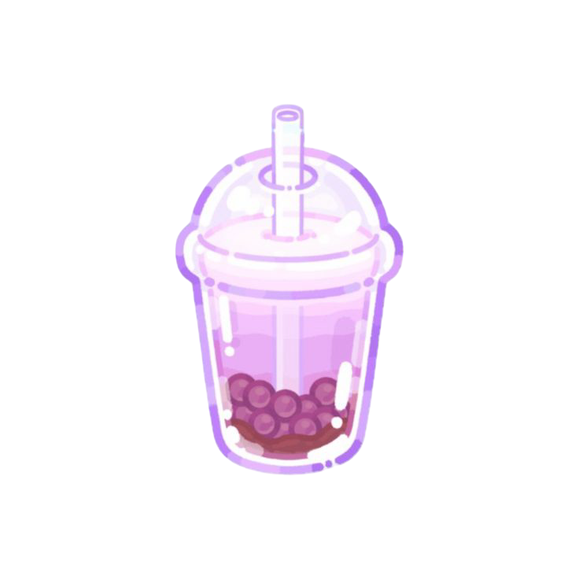
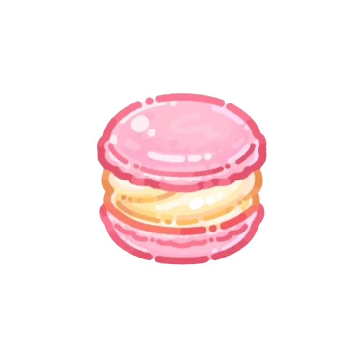
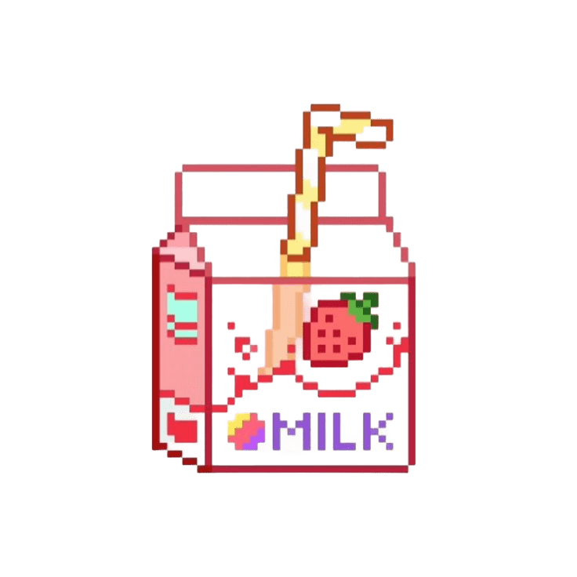
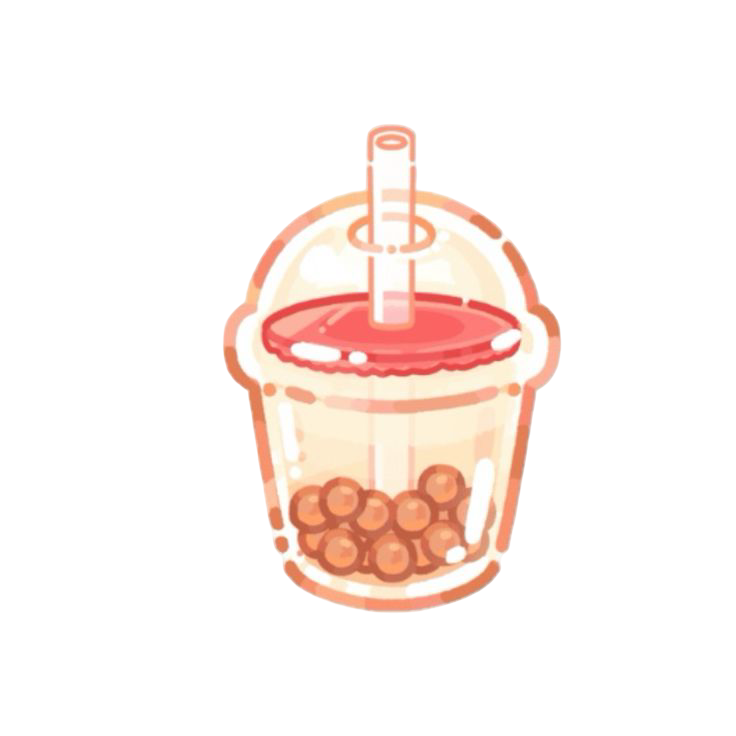
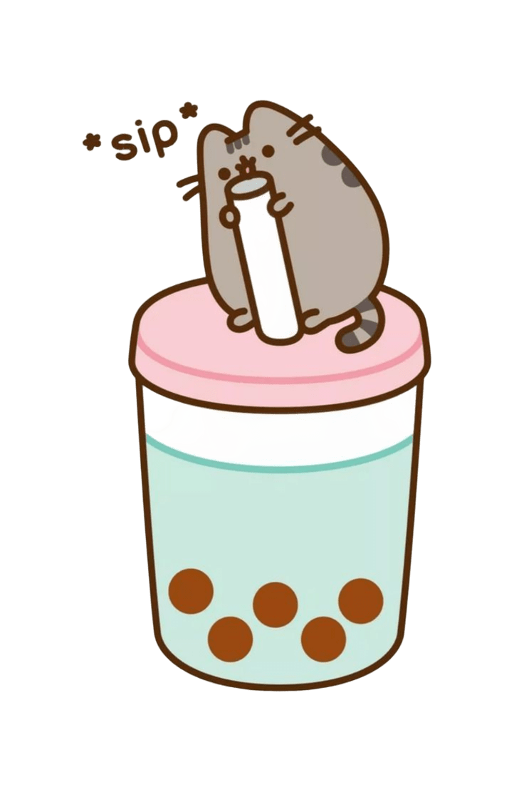

 

  

 

 

&nbsp;

&nbsp;

 

---

##  &nbsp;What is this?

**BubbleTea API** is a full-stack project that lets you explore, manage, and (virtually) taste a collection of 53 bubble teas.

Built as a project combining a **FastAPI** backend with a **MySQL** database on Aiven Cloud, **Firebase** authentication, and an **Angular** frontend with a carefully crafted *kawaii pixel art* aesthetic.

 

---

##  &nbsp;Technology Stack

| Layer | Technology |
| :--- | :--- |
|  **Frontend** | Angular 21 · SCSS · Firebase Auth |
|  **Backend** | FastAPI · Python 3.11 · SQLAlchemy |
|  **Base de dades** | MySQL · Aiven Cloud |
|  **Autenticació** | Firebase Authentication |
|  **Deploy** | Vercel (Frontend) · Render (Backend) |

 

---

##  &nbsp;Main Endpoints

###  Bubble Teas
<pre><code>GET    /bubbleteas/        → List with filters (category, vegan, hot...)
GET    /bubbleteas/random → Random drink of the day
GET    /bubbleteas/{id}   → Drink details
POST   /bubbleteas/       → Create drink 🔒
PUT    /bubbleteas/{id}   → Edit drink 🔒
DELETE /bubbleteas/{id}   → Soft delete 🔒</code></pre>

###  Users
<pre><code>GET    /usuarios/                → User list
POST   /usuarios/                → Registration (public)
GET    /usuarios/firebase/{uid}  → Profile by Firebase UID
PUT    /usuarios/firebase/{uid}  → Update profile 🔒</code></pre>

###  Other
<pre><code>GET    /categorias/  → Drink categories
GET    /toppings/    → Available toppings
GET    /alergenos/   → Allergen information
GET    /pedidos/     → Orders</code></pre>

> 🔒 *Protected endpoints require a Firebase token (`Authorization: Bearer <token>`).*

 

---

##  &nbsp;Project Structure

<pre><code>BBT/
├── 🐍 backend/
│   ├── main.py
│   ├── models/
│   ├── routers/
│   │   ├── bbt.py          → Drink CRUD + filters + JOINs
│   │   ├── categorias.py
│   │   ├── toppings.py
│   │   ├── usuarios.py
│   │   └── pedidos.py
│   └── database/
│
└── 🅰️ frontend/
    └── src/app/
        ├── pages/
        │   ├── home/        → Hero + Stats + Random drink
        │   ├── bebidas/     → Grid with filters 🔒
        │   ├── login/
        │   ├── register/
        │   ├── user/        → Profile + Editing
        │   └── admin/       → CRUD Panel 🔒
        └── services/</code></pre>

 

---

##  &nbsp;Run Locally

### Backend
<pre><code>cd backend
pip install -r requirements.txt
cp .env.example .env    # Fill in the credentials
uvicorn main:app --reload</code></pre>
> ⚡ **Availability:** The backend stays active without *cold starts* thanks to an automatic ping from [Keep-Alive](https://github.com/mee96/keep-alive).
> 
### Frontend
<pre><code>cd frontend
npm install
ng serve</code></pre>

> Open `http://localhost:4200` ✨

 

---

##  &nbsp;Environment Variables

Create a `.env` file in the `backend/` directory:

<pre><code>HOST=...
USER=...
PASSWORD=...
DB=...
PORT=...</code></pre>

*For **Firebase Admin** (required for protected endpoints), add the `FIREBASE_CREDENTIALS` variable with the Service Account JSON.*

 

---

##  &nbsp;Key Features

*  **53 Bubble Teas:** Complete catalog with categories, toppings, and allergens.
*  **Random drink of the day:** Dynamic generator on the user profile.
*  **Advanced filters:** By vegan, hot, category, or active status.
*  **Firebase Authentication:** With `firebase_uid` integrated as the user PK.
*  **Soft Delete:** Drinks are never physically removed from the database.
*  **Kawaii Aesthetic:** Pixel art design with the *Press Start 2P* font.

 

---

 

<b>made with 🧋 for the love of 🧋</b>

  

Developed by **Carme Medina Canalda** 
*Full Stack Developer · Barcelona*

*"If the architecture is right, everything will fit"*

 

